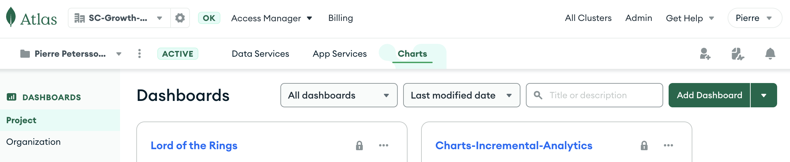
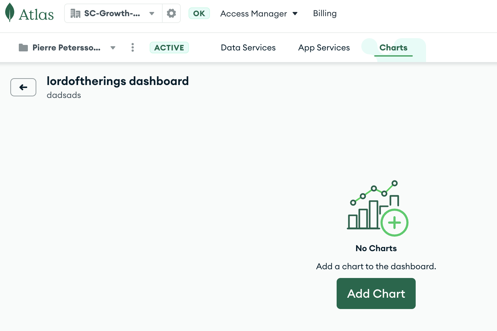
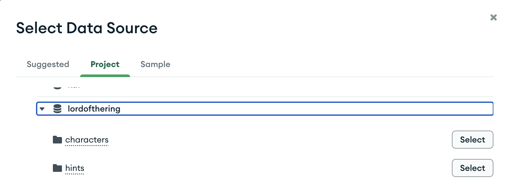
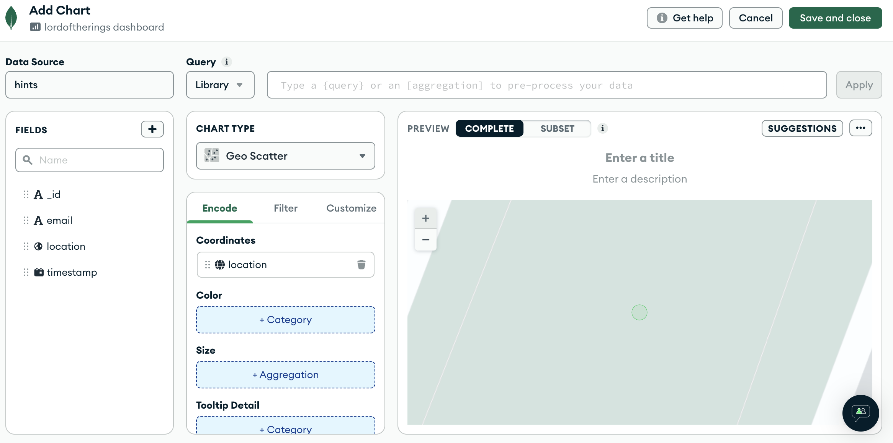
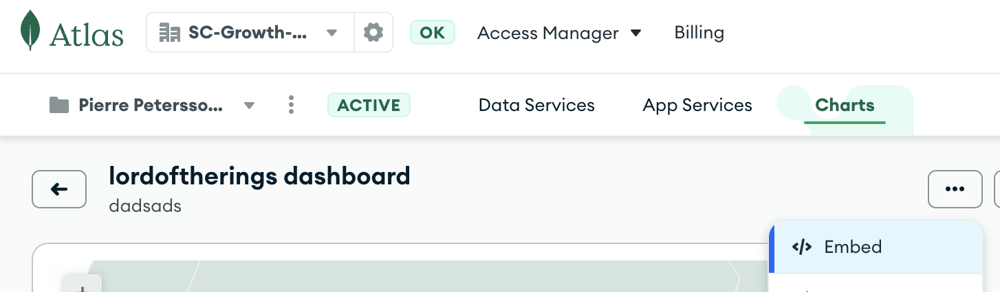
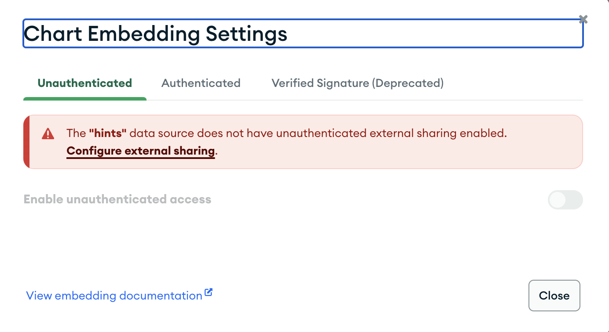
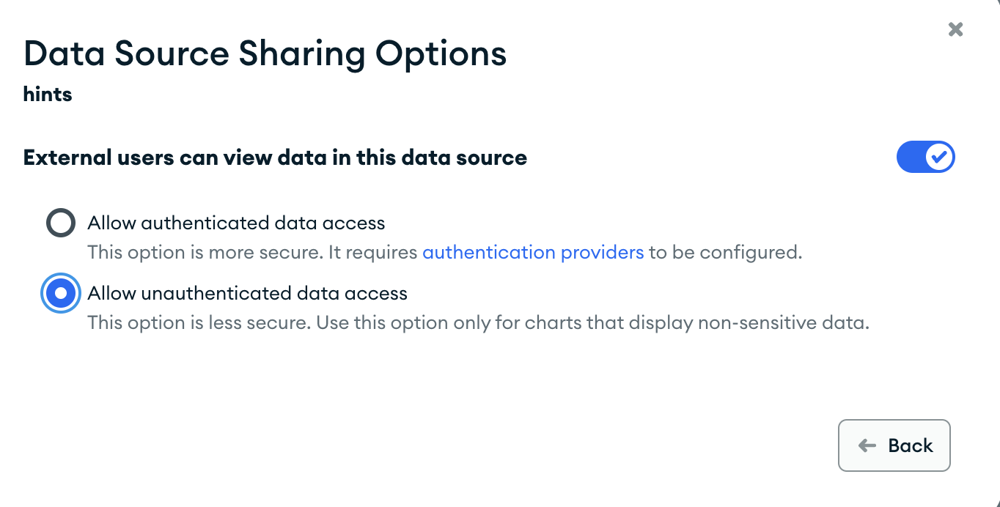
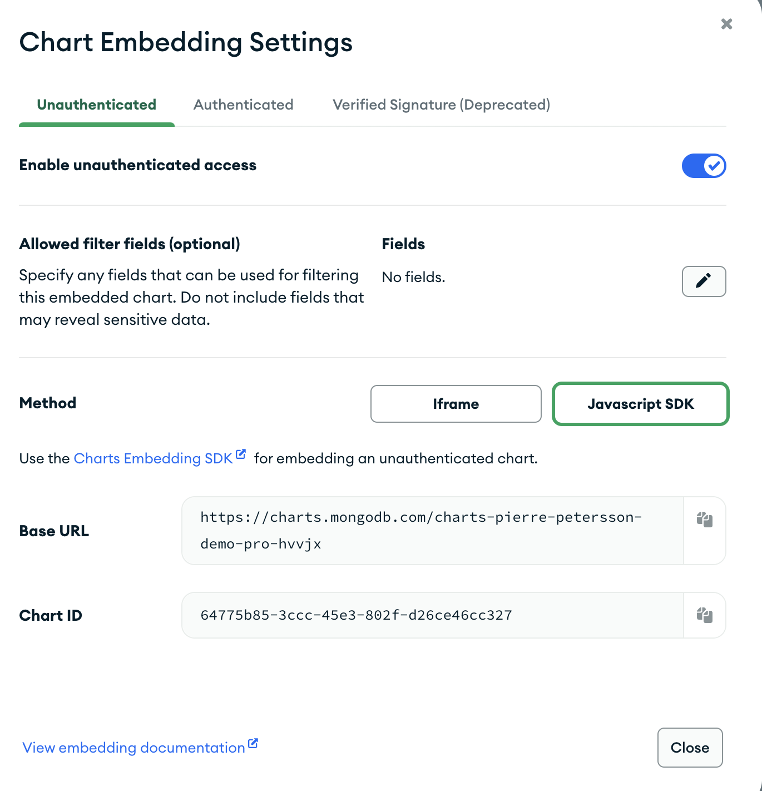
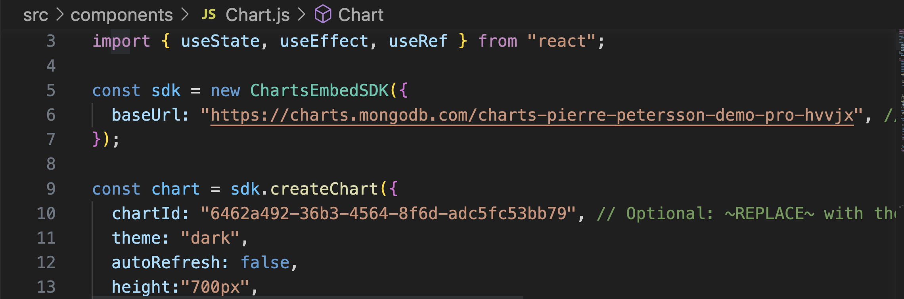
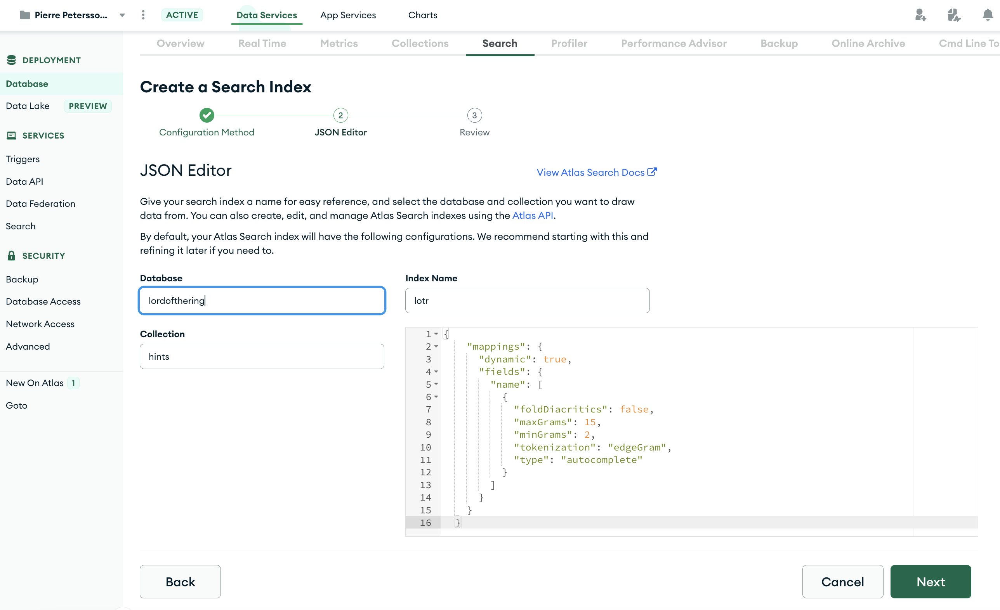

# Lord of the Rings MongoDB Atlas Demo
The setup commands and all are tested on MacOS

# Credits
Thanks to Joel Lord @joellord for helping out building out the react application as myself am a total newbie. Thanks to Angelo Reale @angeloreale for the idea of the Ring of power game, to demonstrate MongoDB Atlas capabilities. 


## Prerequistes

1. Created a new MongoDB Atlas project for your LOTR app
2. Created a new cluster inside that project for LOTR data that is running
3. Created an API Key inside that project, and recorded the public and private api keys,for more information see https://www.mongodb.com/docs/atlas/configure-api-access/#create-an-api-key-for-a-project
4. Installed dependencies for this script: node, mongodb-realm-cli"


## Install Realm CLI
```
npm install -g mongodb-realm-cli
```

## Update env.var

Update the env.var to reflect your settings, you will need to update.
The REALM_CLIENT_APP_ID you will need to update after that you have run the realm cli create command in the next step.

Example:
```
ATLAS_CLUSTER_NAME=demo-cluster
ATLAS_PUBLIC_API_KEY=wancyeds
ATLAS_PRIVATE_API_KEY=db235axa-xdyd-3543-b534-19fe60e755ef
ATLAS_PROJECT_ID=5f49dca27a4f7e35487f7e0c
APPLICATION_NAME=lotr2
REALM_CLIENT_APP_ID=
```

## Create an New App in Atlas App Services
You will need to create an App in Atlas services. You can do it with a script, running setup.sh. You can also do it using the UI.

```
./setup.sh
```

The setup script will also update the APP ID variable and App.js.

env.var example:
```
ATLAS_CLUSTER_NAME=demo-cluster
ATLAS_PUBLIC_API_KEY=wancyeds
ATLAS_PRIVATE_API_KEY=db235axa-xdyd-3543-b534-19fe60e755ef
ATLAS_PROJECT_ID=5f49dca27a4f7e35487f7e0c
APPLICATION_NAME=lotr2
REALM_CLIENT_APP_ID=lotr-alugj
```

App.js example:
```
const atlasAppId='lotr-alugj';
```
## Create database and load with with data
Connect to your MongoDB Cluster using the MongoShell, you can also access mongoshell from within the MongoDB Compass. And then run these commands

```
// Create lordofthering ring database
use lordofthering
// Create a MongoDB TimeSeries collection, that will store all the hints.
db.createCollection(
    "hints",
    {
       timeseries: {
          timeField: "timestamp",
          metaField: "email",
          granularity: "seconds"
       }
    }
)

// Insert one record that will be starting point for the game.
db.hints.insertOne({
  email: "pierre.petersson@mongodb.com",
  timestamp: new Date(),
  location: { type: "Point", coordinates: [ -73.9928, 40.7193 ] }
})

// Insert all LOTR characters
db.characters.insertMany([{
    "id": 10241,
    "name": "Aragorn, Sam, Gandalf, Frodo, Merry, Legolas, Pippin, Gimli, Boromir",
    "sprite": "characters/fotr0853.jpg"
},
{
    "id": 10242,
    "name": "Gollum",
    "sprite": "characters/ttt0059.jpg"
},
{
    "id": 10243,
    "name": "Legolas",
    "sprite": "characters/unuse16.jpg"
},
{
    "id": 10244,
    "name": "Thranduil",
    "sprite": "characters/htrlr146.jpg"
},
{
    "id": 10244,
    "name": "Ring of power",
    "sprite": "characters/fotr0796.jpg"
},
{
    "id": 10244,
    "name": "Frodo",
    "sprite": "characters/rotk2513.jpg"
},
{
    "id": 10246,
    "name": "Bilbo",
    "sprite": "characters/fotr0869.jpg"
},
{
    "id": 10247,
    "name": "Arwen",
    "sprite": "characters/rotk0363.jpg"
},
{
    "id": 10248,
    "name": "Nazgul",
    "sprite": "characters/fotr0025.jpg"
},
{
    "id": 10249,
    "name": "Pippin",
    "sprite": "characters/unuse09.jpg"
},
{
    "id": 10250,
    "name": "Éowyn",
    "sprite": "characters/unuse09.jpg"
},
{
    "id": 10251,
    "name": "Galadriel",
    "sprite": "characters/fotr0002.jpg"
},
{
    "id": 10252,
    "name": "Arwen",
    "sprite": "characters/fotr0589.jpg"
},
{
    "id": 10253,
    "name": "Boromir, Pippin, Sam, Legolas, Aragorn",
    "sprite": "characters/unuse02.jpg"
},
{
    "id": 10254,
    "name": "Thorin",
    "sprite": "characters/htrlr102.jpg"
}
])

```

### Create a Atlas Chart - Geo Scatter
1. Click on Add Dashboard in Atlas Charts


2. Add a chart


3. Select your data source which is your cluster and the hints collection in the lordofthering database



4. Create the map using atlas charts
Drag the location field to the coordinates field as shown in below picture.



5. Click on Save and Close

### Embedding chart in application
To be able to embed the chart we need to follow the below steps:

1. Click on the ... icon on top right corner of the chart and then select embed, see below



2. Once you have clicked on embed you will be presented the following:



3. Click Configure external sharing, and set the following setting shown below. And then click on the back button.



4. Enable Unauthenticated access, and record, Base Url and Chart Id



5. Update src/components/Chart.js, row 6 and row 10, with the above Base Url And Chart Id.



### Create Atlas Search Index

1. Create an Atlas Search index and set index name to "lotr" on your lordofthering database on collection characters. Use the following index configuration, use json editor. For more information see: https://www.mongodb.com/docs/atlas/atlas-search/create-index/

Use below index definitions
```
{
    "mappings": {
      "dynamic": true,
      "fields": {
        "name": [
          {
            "foldDiacritics": false,
            "maxGrams": 15,
            "minGrams": 2,
            "tokenization": "edgeGram",
            "type": "autocomplete"
          }
        ]
      }
    }
  }
```
You should see something like this:



Just follow the next steps and use default settings and you will now have a Atlas Search Index created for your characters collection in the lordofthering database.

### Deploy application to App Services

Before you can host your app in Atlas, you need to enable hosting. For more information see https://www.mongodb.com/docs/atlas/app-services/hosting/enable-hosting/

Run below command in the root of repo, it will build the application and deploy it to App Services
```
./deploy.sh
```

### Access the application 
You can now access the application from the endpoint described, in hosting/config.json   

Example below:
```
"app_default_domain": "lotr-alugj.mongodbstitch.com"
```

## Clean up anonymous users
When prompted for appId use the atlasAppId you have.
```
realm-cli users delete
```
